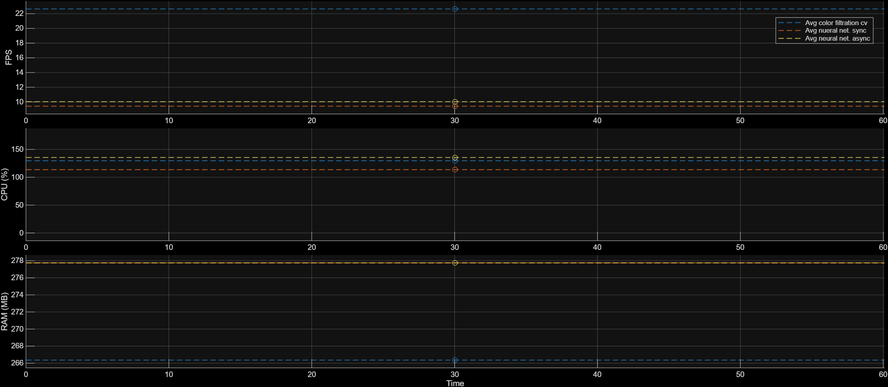

# ROS 2 Vision Playground 

A modular, high-performance computer vision node designed for **Raspberry Pi 5** running **Ubuntu 24.04** (Noble) and **ROS 2 Jazzy**.

This project serves as a development platform for experimenting with real-time perception algorithms, sensor integration, and distributed system architecture. The goal is to create a robust "visual cortex" capable of analyzing the environment and generating high-level control signals (e.g., error vectors) for autonomous robot navigation.

## Key Features

* **Dispatcher Architecture:** Enables dynamic run-time switching between processing algorithms (Classical CV vs. AI) via ROS parameters, ensuring zero downtime.
* **Color Object Tracking:** Implements HSV thresholding, contour analysis, and moment-based centroid calculation for tracking.
* **AI Hand Tracking:** Integrates Google MediaPipe for robust hand landmark detection using an asynchronous/synchronous pipeline.
* **Custom Object Detection (YOLOv8):** Supports custom-trained neural networks for specialized industrial object recognition using the Ultralytics YOLOv8 architecture. Compatible with multiple inference backends (PyTorch, ONNX, NCNN) for optimized performance on ARM CPUs.
* **Bandwidth Optimization:** Utilizes `sensor_msgs/CompressedImage` for transport to minimize Wi-Fi saturation and latency during remote debugging.
* **Dynamic Reconfiguration:** Key parameters (e.g., HSV thresholds) can be tuned dynamically at runtime.
* **Portable Design:** Uses dynamic path resolution (`ament_index_python`) for model files, ensuring the package runs on any machine without hardcoded paths.

## Engineering Challenge 1: Handling Asynchronous Inference Latency

A critical challenge encountered during the development of the AI module was managing the discrepancy between the high data rate of the sensor and the inference speed of the CPU using `mediapipe`.

### The Problem: Buffer Bloat
The camera hardware (IMX708) operates at **30 FPS** (generating data every ~33ms). However, complex neural network inference on the CPU takes approximately **90-100ms** per frame (~10 FPS). 

In a standard asynchronous callback structure, the ROS 2 message queue filled rapidly with unprocessed frames. This "buffer bloat" resulted in a constantly increasing system latency that peaked at **~7 seconds**, making real-time control impossible.

### The Solution: Application-Level Flow Control
To resolve this, a **Frame Decimation (Skipping)** logic was implemented at the ingress point of the node.

* **Throughput Matching:** The system actively monitors the input frame sequence.
* **Deterministic Dropping:** The algorithm systematically discards frames that exceed the processing capacity of the inference engine. For a 30 FPS input and ~10 FPS inference capability, the node processes only every **3rd** frame.
* **Results:**
    * **Zero-Queue Operation:** Prevents the accumulation of stale data in input buffers.
    * **Latency Reduction:** Reduced end-to-end system latency from **~7000ms to <200ms**.
    * **Resource Management:** Allows the CPU to focus solely on the most recent visual data, ensuring control signals reflect the current state of reality.

## Engineering Challenge 2: Obtaining optimal frame rate running yolo8 nano model:

A secondary challenge involved maximizing the throughput of the custom object detection model `YOLOv8 Nano`.

**The Problem:** Standard PyTorch inference (`.pt`) is optimized for NVIDIA GPUs and struggles with thread management on ARM CPUs, leading to inefficient core utilization (~65%) and low frame rates.

**The Solution:** Backend Benchmarking To identify the optimal runtime environment, three different model formats were evaluated on the live hardware.

## Hardware & Prerequisites

* **Hardware:** Raspberry Pi 5 (8GB RAM) + Raspberry Pi Camera Module 3 (CSI).
* **OS:** Ubuntu 24.04 LTS (Noble Numbat).
* **ROS Distro:** ROS 2 Jazzy Jalisco.

> **Important:** Standard Ubuntu drivers do not support the RPi Camera Module 3 correctly out of the box. You MUST build the Raspberry Pi fork of `libcamera` from source. 
> See my detailed guide here: **[Raspberry Pi 5 + Camera Module 3 Setup Guide](https://github.com/erykpawelek/libcamera_ros2_setup)**

## Dependencies

Ensure you have the following installed on your Raspberry Pi:

```bash
sudo apt install ros-jazzy-cv-bridge ros-jazzy-image-transport-plugins python3-opencv
# Note: It is recommended to use a virtual environment for Python packages
pip3 install mediapipe
pip3 install ultralytics onnx onnxruntime ncnn --break-system-packages
```
## Architecture Notes & Experimental Branch

During development, two different architectural approaches were tested to handle the AI inference load on the Raspberry Pi CPU.

#### 1.Synchronous Mode (Production - `main`)
* Current Default.
* Uses `RunningMode.VIDEO`.
* Pros: Zero latency, predictable behavior. Best for real-time analysis.

#### 2.Asynchronous Mode (Experimental)
* Uses `RunningMode.LIVE_STREAM` with a custom frame skipping algorithm.
* Pros: Decouples camera acquisition from processing.
* Cons: Introduced significant latency (~7s) on this hardware configuration due to internal buffering limitations (before frame skipping was implemented).

## Benchmarking 

**Time series figures (Python):**


**Averages figures (Python)**



> **Note:** In linux system CPU percentage usage is calulated in way where each core has 100%. In our case Raspberry PI 5 has 4 cores so maximum capacity of our processor would be expresed as 400%.

>**Note:** All test were performed on `1536x864` resolution. 

**1. Color Filtration**
* **Performance:** Highest throughput (~22.6 FPS).
* **Resource Usage:** Moderate CPU load (~130%).
* **Conclusion:** Extremely efficient for simple tasks like line following or colored object tracking.

**2. Neural Network - Synchronous Mode**
* **Performance:** ~9.4 FPS. Frame rate is strictly locked to the CPU inference time.
* **Resource Usage:** Lowest CPU load (~115%).
* **Characteristics:** Zero-lag visualization. The displayed frame always matches the inference result perfectly because processing blocks the execution.

**3. Neural Network - Asynchronous Mode**
* **Performance:** ~10 FPS. Maintains a consistent frame rate due to the implemented frame-skipping logic (`10 FPS target`).
* **Resource Usage:** Highest CPU load (~140%) due to overhead from thread management and context switching.
* **Characteristics:** While this mode introduces slight visual latency compared to the synchronous approach, it is the **safest architecture for production robotic systems**. By decoupling inference from the main thread, it ensures that the ROS 2 node remains responsive to other callbacks (e.g., emergency stop signals, sensor fusion) even under heavy load.


**4. Neural Network - YOLOv8 Nano using PyTorch/`.pt`**
* **Performance:** Lowest, stable ~2.7 FPS. 
* **Resource usage:** Moderate CPU load (~192%).
* **Analysis:** Despite using the smallest Nano model, the computational cost increased significantly compared to MediaPipe. The logs indicate suboptimal resource utilization (only ~50% of the 4-core capacity). This confirms that the standard PyTorch runtime is not optimized for ARM architectures, leading to significant overhead and poor thread scheduling.
* **Characteristics:** High latency makes this format unsuitable for real-time robotic control loops.

**5. Neural Network - YOLOv8 Nano using ONNX Runtime/`.onnx`**
* **Performance:** Critical saturation (~323%). Total system load peaked at 388%.
* **Resource usage:** Highest, ~323%. This backend format is well opimized for processor computing but our ARM **Broadcom BCM2712** isn't best at computing floating point calculations. While opperating on this mode overal CPU's usage went to 388%.
* **Analysis:** ONNX Runtime efficiently parallelized the workload across all cores, pushing the CPU to its thermal and arithmetic limits. However, the bottleneck shifted from software inefficiency to raw hardware limitations—specifically, the Broadcom BCM2712's floating-point (FP32) compute capability.
* **Characteristics:** Unacceptable latency combined with complete resource exhaustion, leaving no headroom for other robot processes.

**6. Neural Network -YOLOv8 Nano using NCNN/`.ncnn`**
* **Performance:** Best CPU-only result among YOLO formats (~3.8 FPS).
* **Resource usage:** Optimized (~261%).
* **Analysis:** The NCNN framework (developed by Tencent) is explicitly designed for mobile/embedded systems. It leverages ARM NEON instructions and optimized memory alignment. The results show a 40% FPS improvement over PyTorch while maintaining a reasonable CPU load, proving it is the most efficient backend for CPU-based inference on Raspberry Pi.
* **Characteristics:** While latency is still high for high-speed navigation, this format offers the best trade-off for static tasks or slow maneuvers without hardware acceleration.

**System Headroom:**
Running modern Convolutional Neural Networks (CNN) like YOLOv8 on a Raspberry Pi 5 CPU is possible but constrained by compute power (2-4 FPS). While NCNN offers the best CPU performance, achieving real-time control (>30 FPS) requires a dedicated hardware accelerator, such as the Raspberry Pi AI Kit (Hailo-8L). This will be the next step in the project development.